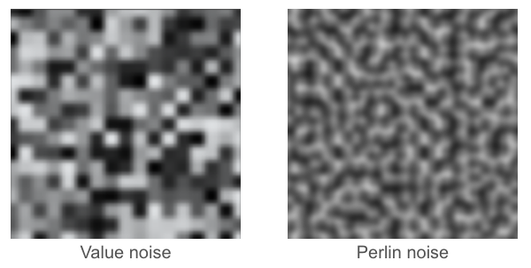
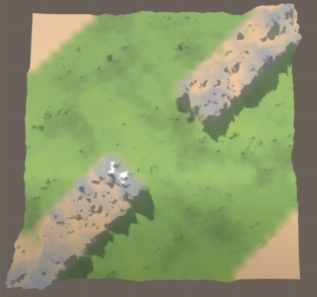
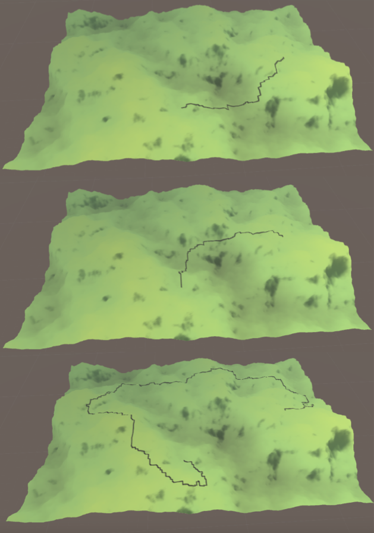

# Procedural Terrain Generation
###### Internship and Final Degree Project

Engine version: Unity3D 5.3.4f1

This project consists on a procedural terrain generation tool for use by designers at digital entertainment companies, and is especially suitable for its use in videogames. The algorithms in this tool handle the generation of several layers of the scenerio, including:
- Orography or basic landscape features
- Water bodies (oceans, lakes and rivers)
- Roads

One of the main design principles of this project is the potential of *on-the-fly* generation, that is, the ability to generate all the results on runtime only from the minimum high-level definition data that allows the reproducibility of the results. 
Another important goal is to design a rich and dynamic interaction. On one hand, the algorithms should provide a set of inputs that is wide enough that the user can deeply control the results – on the other hand, the long processing times of the algorithms must interfere as little as possible with the fluidity of the UI.

## Orography Generation

The generation of basic landscape is handled using fractalized Perlin noise. This noise algorithm was created as result of the frustration of his inventor, Ken Perlin, with the unrealistic look of the textures that resulted from other algorithms at the time. 

The noise used is fractalized, which means that several layers are generated at different scales and intensities, and then overlapped, creating this way much more complex and realistic results.

This algorithm allows for a rather large set of inputs, from which some of the currently used ones in the tool are:
- **Vertical offset**. This applies a displacement to the whole terrain, which results in changes in the overall height.
- **Vertical scale**. This applies a scale factor to the whole terrain, which results in changes in the variation from the average height of the terrain.
- **Persistence**. This controls the variation in intensity from one fractal layer of noise to the next one, which results on the roughness or smoothness of the terrain. Lower values will make the higher-scale layers relatively more important, hence creating smoother terrain. On contrast, higher values will give the lower-scale layers more relative importance, hence giving more intensity to details of the terrain and creating rougher landscapes.

Nevertheless, a lot more inputs exist, although their edition is not currently supported by the tool.
- **Offset vector and rotation**. This controls the 2D plane that intersects the generated Perlin noise 3D space and is used to generate the values of the terrain. Thus, this could be use to set the random seed of the algorithm and would affect on the variety of the results. *Currently used values: (0, 0, 0) offset and (0, 0, 0) rotation*.
- **Frequency**. This controls the overall scale of the noise layers, and would result on changes in the width of the landscape elements. *Currently used value: 1.0*.
- **Number of octaves**. This controls the amount of fractal layers to produce. The more layers that are generated, the more detail definition that is calculated. *Currently used value: 6*.
- **Lacunarity**. Similar to persistence, this controls the variation in scale from one fractal layer of noise to the next one, which also results on the roughness of the terrain. However, its impact would be slightly different, affecting on the scale of the details on the terrain rather than their intensity. *Currently used value: 2.0*.

#### Multi-area editor.

In order to give even more control inputs to the tool, this system allows the user to create several terrain areas, each one of them with their own orographic characteristics, and draw their distribution on a global map of the level. This allows for more complex and realistic-looking worlds.

In this example, a designer working on a 1-vs-1 strategy battle game uses this tool in order to create one of the levels for the game. Three different terrain areas are defined:

1. Battle field (white). Easily navigatable but not overly simple: mid height and average flatness and smoothness.
2. Player bases (pink). Easily navigatable and allowing for easy building: mid height, flat and smooth.
3. Mountain obstructions (dark gray). Non-navigatable, used to delimit the two halves of the map, allowing a navigatable central section in which to concentrate the action of battle: extreme height, mountainous and rather rough.

## Water bodies generation

This module shows the generation of water bodies using different flooding algorithms.

#### Water masses (oceans and lakes).

The flooding algorithm used for this purpose performs horizontal flooding from the given source point and at the specified height.

###### All three examples use the same source point coordinates at (0.0, 1.0), but different water level heights: from left to right, 0.4, 0.5 and 0.55.

#### Water courses (rivers).

The flodding algorithm used here is a bit more complex, performing flooding on the steepest negative slope from the source point and generation of intermediate lakes at local minimum points.

###### All three examples use the same source point coordinates at (0.8, 1.8), but different roughness values of the terrain: from left to right, 0.5, 0.3 and 0.7.

## Roads generation

The algorithm used for this purpose is an A* search algorithm, which calculates the minimum cost path between two given points, using the euclidean distance for both real cost and estimation functions. However, in order to allow for more control on the results, two additional inputs have been designed:
- **Maximum slope**. This controls the maximum absolute-value slope the calculated path can have.

###### From top to bottom, paths generated from point (1.4, 0.5) to point (2.5, 1.5), using maximum slopes of 75%, 62.5% and 50%.

- **Bridge cost penalty**. This sets a penalty cost for path sections generated over water bodies as bridges, and forces the algorithm to search other alternative paths as lower-cost options.

###### From left to right, paths generated from point (1.2, 1.5) to point (2.0, 1.3), using bridge penalty cost values of 0%, 1% and 2.5%.

## Parallel architecture

One of the biggest challenges of this project, in which a huge part of the efforts have been involved with, is the development of the tool in a way that the slow and heavy algorithms would not interfere with the interaction with the UI. This is achieved developing a parallel architecture in which each element is calculated in a seperate thread, and appear on screen only once their results have been obtained. 

Furthermore, this benefits extraordinarily from implementing a **level streaming** solution. This is a technique widely used in videogames that consists on loading only the portions of the terrain that are visible to the player. This way, only said portions of terrain have to be calculated instead of the whole map, so the generation is way lighter and less time-consuming, especially when each portion or chunk is calculated in a seperate thread.

The synchronization of this threads is handled with the use of coroutines. These execute **sequencially** at the end of the game logic loop, so synchronization is easily handle by starting a coroutine that continuously checks whether its associated thread has finished (this is achieved via a boolean variable with a lock that the thread sets to true once finished its execution method).

Finally, due to the structure of the different layers of the scenario, threads (and couroutines) have to also be structured in a similar fashion. This way, whenever a change in orography is made, all changes to terrain have first to be computed – then, all water bodies are recalculated, and once all of them are finished, all roads can be recalculated too. Similarly, whenever a change is made in a specific water body, road recalculation can only begin once that water body's recalculation process has ended.
